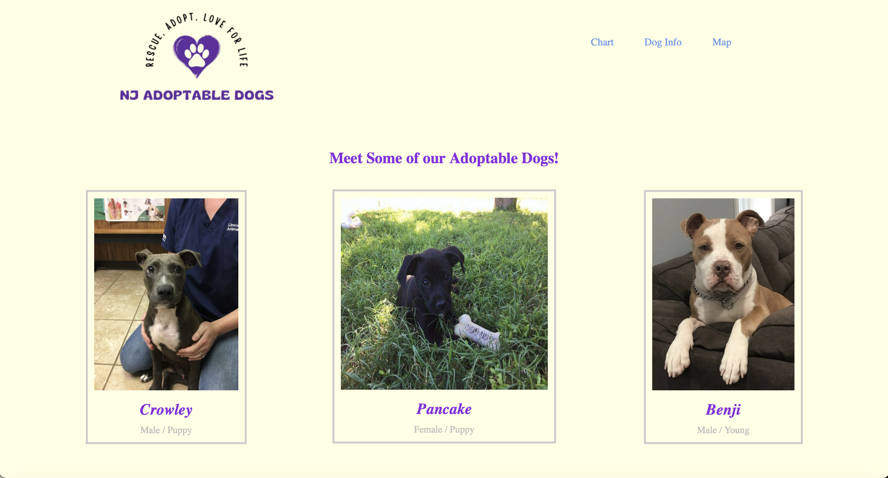

# PET ADOPTION WEBSITE
Table of Contents

1. [Introduction](#introduction)
2. [Installation](#installation)
3. [Steps](#steps)
4. [Website](#website)
5. [Visualizations](#visualizations)
6. [References](#references)

## Introduction

There are approximately 3.1 million dogs in shelters in the US with over 1.5 million cats and dogs being killed in these shelters. When it comes time to get your family's next best friend, adoption is always the best option. For this project, we are using the “Adoptable Dogs” dataset, which contains information on over 3,000 adoptable dogs across the United States.. The data includes information on things like the dogs location, breed and even if they are house-trained or not.

## Installation 

1. Download the Flask App and save to files
2. From the Flask App directory, in your terminal run:

    ``` pip install Flask ```
## Steps

1. Cleaned and analyzed data using Python in Jupyter Notebook
2. Stored data in SQLite tables 
3. Created a Python Flask- powered API, which is connected to the data stored in SQLite database
4. Created HTML/CSS files to create a webpage and style it accordingly
5. Used charts.js to create user friendly interactions and visuals
6. Used JS in conjunction with Open Street Map to create dog adoption map
7. Used plotly to create a tree map

## Website

#### Front Page 



## Visualizations

##### Click for larger image
<div>
  
  
  
</div>

## References
1. edX Boot Camps LLC
2. Kaggle - "Adoptable Dogs in the US" dataset
3. Stack Overflow
4. YouTube


